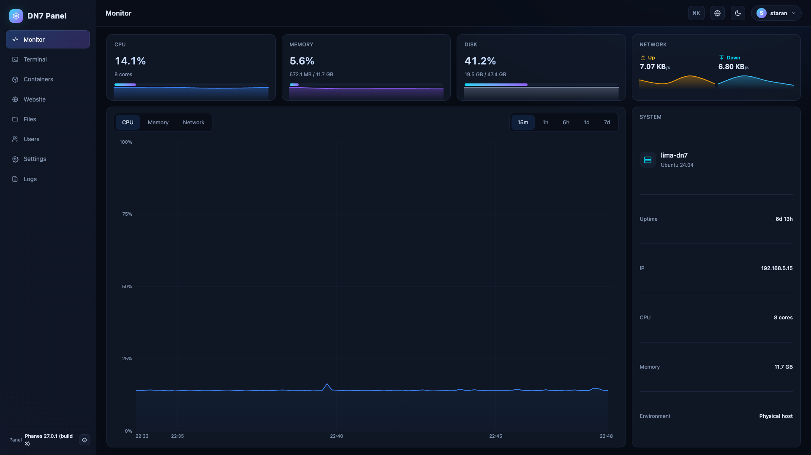
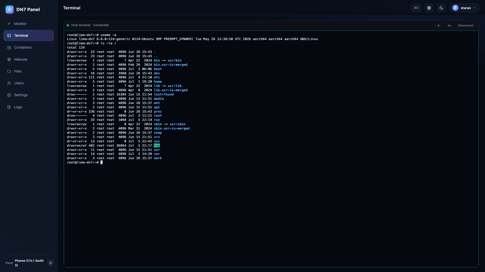
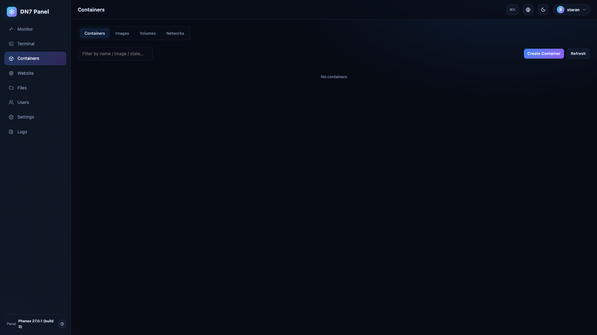
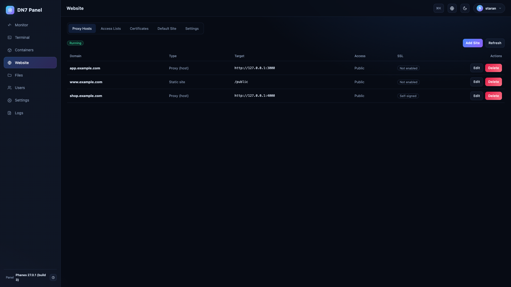
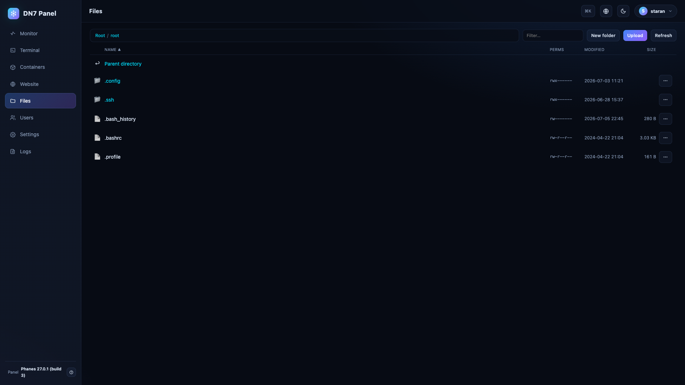
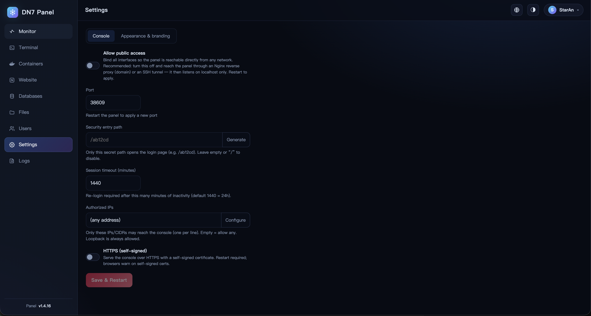

# DN7 Panel

> ## 🙏 致谢 / Acknowledgements
>
> 特别感谢 **[LINUX DO](https://linux.do)** 社区 —— 一个真诚、专业、友善的技术社区。
> 本项目的诸多想法、反馈与打磨都受益于这里的伙伴们。
>
> Special thanks to the **[LINUX DO](https://linux.do)** community — *real,
> professional, kind.* Much of this project's direction and polish owes to the
> people there.

A small, single static Rust binary that turns a Linux host into a fully managed
node via an **on-box web console** — monitoring, a web terminal, and Docker /
Website / MySQL / file management — with no backend, no panel token, and no
runtime dependencies.

> Part of the [Digital Network 7](https://dn7.cn) suite ·
> <https://github.com/Digital-Network-7/DN7-Panel>

中文文档：[`docs/README.zh-CN.md`](docs/README.zh-CN.md)

## Highlights

- **One static binary.** Pure Rust + rustls (musl build), no system libraries,
  no `docker`/`nginx`/`openssl` CLI dependencies at runtime.
- **Self-managing.** Installs itself to a stable path, sets up redundant boot
  autostart, daemonizes, and self-heals via a two-half supervisor.
- **On-box, no backend.** The console authenticates locally and acts on the
  host directly; secrets are encrypted with a machine-bound key.

## Fit and trade-offs

DN7 Panel is designed for single-host or small-node operations where the person
using the console is also trusted to administer the machine. Its strengths are
simple deployment, no external control plane, and direct access to Docker,
Website, MySQL/MariaDB, files, and a terminal from one embedded UI.

That also defines its limits. It is not a multi-tenant SaaS control plane, and
it deliberately has a high local blast radius: many features operate with host
administrator privileges. The default console listener is reachable on all
interfaces, protected by a random port, a random safe-entry path, and a random
password shown once. For internet-facing hosts, the recommended posture is to
disable public access after setup and reach it through an SSH tunnel or a
properly configured reverse proxy.

## Roles

The binary runs as one of two roles, chosen by argv:

- `dn7-panel` (no args) — **supervisor**: keeps the panel role alive by spawning
  *itself* with the `panel` subcommand and restarting it on exit.
- `dn7-panel panel` — **panel role**: runs the on-box web console.

The two halves guard each other (pid + heartbeat files under `DN7_RUNTIME_DIR`):
the supervisor restarts the panel if it exits, and the panel relaunches the
supervisor if it dies. Because it's a single binary, a self-update replaces one
file and both halves come back upgraded. In normal use you only run the no-arg
form — it splits off the panel itself.

## Quick start

Grab the latest static binary from the
[**Releases**](https://github.com/Digital-Network-7/DN7-Panel/releases) page
(musl builds for `x86_64` and `arm64`) and run it directly — no build step, no
dependencies:

```bash
# pick the asset matching your architecture, then:
chmod +x dn7-panel
sudo ./dn7-panel
```

> **No release for your platform / version?** Build from source instead — it's
> pure Rust + rustls, so a release build needs no system libraries:
>
> ```bash
> cargo build --release
> sudo ./target/release/dn7-panel
> ```
>
> Hitting a problem, or missing a build for your platform? Please open an
> [**Issue**](https://github.com/Digital-Network-7/DN7-Panel/issues) — bug
> reports and requests are very welcome.

On a normal launch the binary **installs itself to `/var/dn7/panel/dn7-panel`**
and re-execs from there, so you can run the downloaded binary from anywhere — no
need to create directories by hand. Runtime state is grouped under
`/var/dn7/panel/{data,run,log}`.

It also installs **redundant boot autostart** so the panel returns after a
reboot, using whatever the host supports (best-effort, idempotent, root only):
a **systemd unit**, a **cron `@reboot`** entry, and an **`/etc/rc.local`** line.
Single-instance, so even if several fire at boot only one supervisor runs.

It then **detaches into the background**, appending logs to
`/var/dn7/panel/log/dn7-panel.log` (trimmed in place once past ~5 MiB). Pass
`--foreground` / `-f` (or `DN7_FOREGROUND=1`) to stay attached for debugging.

The launch banner prints the generated console URL, username, and password
**once**. The first-run port is a random high port, and the login page is behind
a random safe-entry path such as `/abcd12`. Forgot the password? `dn7-panel
reset` (install owner / root only) regenerates it.

Useful owner/root-only CLI commands:

```bash
dn7-panel reset              # reset the console account + password
dn7-panel port [N]           # set a specific port, or omit N for a random one
dn7-panel access [/path]     # set the safe-entry path, or omit for a random one
dn7-panel version            # print the compiled version
dn7-panel help               # show command help
```

## On-box web console

Served over plain HTTP on the generated port with an auto-generated random
password and safe-entry path. Login is rate-limited and uses a
challenge-response, so the password never crosses the wire in cleartext;
optional self-signed HTTPS and TOTP 2FA are available in settings.

> **Exposure.** By default the console binds **loopback only** (`127.0.0.1`) —
> reach it from the host or through an **SSH tunnel** / **reverse proxy (domain)**.
> Enabling **"Allow public access"** (Settings → General) binds all interfaces
> (`0.0.0.0`); do that only behind HTTPS or on a trusted network.

Capabilities:

- **Monitoring** — CPU / memory / disk / network throughput, plus a history
  chart (CPU / memory / network over 15m / 1h / 6h / 1d / 7d), sampled in the
  background and persisted to `<data>/metrics-history.json`.
- **Terminal** — a browser PTY shell on the host, and per-container shells
  (`docker exec`).
- **Docker** — images (pull, create), containers (lifecycle, logs, networks,
  in-container terminal, file transfer), networks, volumes, backups.
- **Website** — Docker-mode setup, sites (proxy-host / proxy-container / static),
  custom path rules, HTTPS via Let's Encrypt / self-signed / manual / a named
  cert store, access lists, reload.
- **MySQL** — one DN7-provisioned MySQL/MariaDB instance: lifecycle, connection
  info, multiple databases, account management, port remap, `mysqldump` backup.
- **Files** — browse / upload / download / delete on the host and inside
  containers.

## Screenshots

### Monitoring



### Terminal



### Containers



### Websites



### Files



### Settings



## Configuration

Most operational settings are persisted by the console itself. Web-console
settings live in `<data>/web.json` (0600), update preferences in
`<data>/update.json` (0600), and they take precedence after the first
initialization. Environment variables are optional startup defaults or debug
knobs; there is no `.env` loader.

| Var | Default | Notes |
|-----|---------|-------|
| `DN7_RUNTIME_DIR` | `/var/dn7/panel` | base dir for `data/run/log`; mainly for special deployments/tests |
| `DN7_HEARTBEAT_TIMEOUT_SECS` | `15` | peer liveness threshold |
| `DN7_SUPERVISE_INTERVAL_SECS` | `3` | supervisor child-check interval |
| `DN7_RESTART_BACKOFF_SECS` | `2` | delay between panel restarts |
| `DN7_FOREGROUND` | — | set `1` to stay attached (no daemonize) |
| `DN7_GITHUB_REPO` | `Digital-Network-7/DN7-Panel` | GitHub release repository used by the GitHub update source |
| `DN7_SITE_URL` | `https://dn7.cn` | Digital Network 7 mirror/API base used by the default update source |
| `DN7_WEB_PORT` | parsed, rarely needed | runtime config fallback; current first-run web settings generate and persist a random high port, so prefer `dn7-panel port` or Settings |
| `RUST_LOG` | `info,dn7_panel=info` | tracing filter for foreground/log output |

## Security model

Standalone, on-box, no backend. The console authenticates locally and operates
on the host directly. At-rest secrets (e.g. the web password once changed from
the auto-generated default) are encrypted with a machine-bound AES-256-GCM key
(`<data>/.panel_key`), so a copied file can't be decrypted on another host.
Security-sensitive settings (proxy trust, bind exposure, container privileges,
…) are wrapped in validators with closed-by-default fallbacks — see
[`ARCHITECTURE.md`](ARCHITECTURE.md) §13.

## Build

CI builds static **musl** binaries (x86_64 + arm64) on every push to `main` and
publishes them as a GitHub Release. Pure Rust + rustls, so the static build
needs no system libraries at runtime.

```bash
cargo build --release          # local build
cargo fmt && cargo clippy --all-targets && cargo test
node scripts/check_i18n.js     # UI string consistency (run from repo root)
```

## Development

- Architecture, layering rules, and code-structure standards live in
  [`ARCHITECTURE.md`](ARCHITECTURE.md). `tests/architecture.rs` enforces the
  dependency direction.
- UI strings are in `src/web/ui/js/i18n.js` (4 languages); validate with
  `scripts/check_i18n.js` (or `.py`) after touching the UI.

## License

Licensed under the **GNU Affero General Public License v3.0** (AGPL-3.0-only).
See [`LICENSE`](LICENSE). If you run a modified version as a network service,
the AGPL requires you to offer its source to your users.
